# Destinity vButler — Solution Architecture

**Product:** Destinity vButler Guest App
**Chain:** Browns Hotels & Resorts
**Version:** 1.0
**Date:** 2026-03-15
**Status:** Draft

---

## Table of Contents

1. [Architecture Overview](#1-architecture-overview)
2. [Tech Stack](#2-tech-stack)
3. [System Architecture Diagram](#3-system-architecture-diagram)
4. [Project Structure](#4-project-structure)
5. [Data Architecture](#5-data-architecture)
   - 5.1 JSON Config Files (Static Data Source)
   - 5.2 JSON Schema Definitions
   - 5.3 localStorage Schema (Runtime Persistence)
6. [Module Architecture](#6-module-architecture)
7. [Routing Architecture](#7-routing-architecture)
8. [State Management](#8-state-management)
9. [Component Library](#9-component-library)
10. [Data Flow Diagrams](#10-data-flow-diagrams)
11. [Feature-to-Module Map](#11-feature-to-module-map)
12. [i18n Architecture](#12-i18n-architecture)
13. [PWA Configuration](#13-pwa-configuration)
14. [Theming System](#14-theming-system)
15. [Security Considerations](#15-security-considerations)

---

## 1. Architecture Overview

Destinity vButler is a **client-only Progressive Web App (PWA)** — no backend server is required in this phase. All property and chain-level configuration is driven by **static JSON files**. All runtime state (guest session, requests, complaints, preferences) is persisted in **browser localStorage**.

### Key Architectural Principles

| Principle | Decision |
|-----------|----------|
| **No Backend** | All data sourced from JSON config files + localStorage |
| **Property-Driven Config** | Each hotel property has its own JSON data file |
| **Reservation-Centric** | All features are scoped to an active reservation context |
| **PWA First** | Installable, offline-capable, mobile-optimised |
| **Zero Build Step (Phase 1)** | CDN-loaded libraries; plain HTML/CSS/JS — no bundler required |
| **Modular JS** | ES Modules (`type="module"`) for clean separation of concerns |

---

## 2. Tech Stack

### Core

| Layer | Technology | Rationale |
|-------|-----------|-----------|
| **Markup** | HTML5 | Semantic, accessible structure |
| **Styling** | Tailwind CSS v3 (CDN Play) | Utility-first; rapid UI; design token alignment |
| **Scripting** | Vanilla JS (ES2020+ Modules) | No framework lock-in; full control; fast loads |
| **Reactivity** | Alpine.js v3 (CDN) | Lightweight declarative binding; no build step; pairs perfectly with Tailwind |
| **Icons** | Google Material Symbols Outlined (CDN) | As specified in design system |
| **Typography** | Inter + Playfair Display (Google Fonts CDN) | As specified in design system |

### UI Enhancement Libraries

| Library | Purpose | CDN |
|---------|---------|-----|
| **Swiper.js** | Touch carousels (hero banners, experience cards) | `cdn.jsdelivr.net` |
| **Flatpickr** | Date/time pickers (wake-up call, bookings, transport) | `cdn.jsdelivr.net` |
| **intl-tel-input** | Phone number input with country flags (registration) | `cdn.jsdelivr.net` |
| **Choices.js** | Styled select dropdowns (language, categories) | `cdn.jsdelivr.net` |
| **jsPDF + jsPDF-AutoTable** | Invoice PDF generation (Billing module) | `cdn.jsdelivr.net` |
| **Lottie Web** | Micro-animations (loading, success, empty states) | `cdn.jsdelivr.net` |
| **Day.js** | Lightweight date manipulation (stay countdown, formatting) | `cdn.jsdelivr.net` |
| **Marked.js** | Render hotel description markdown from JSON | `cdn.jsdelivr.net` |

### Data & Persistence

| Concern | Solution |
|---------|---------|
| **Static config data** | JSON files loaded via `fetch()` |
| **Runtime persistence** | `localStorage` with namespaced keys |
| **Session management** | localStorage + `sessionStorage` for tab-scoped state |
| **Offline fallback** | Service Worker caches JSON + assets |

---

## 3. System Architecture Diagram

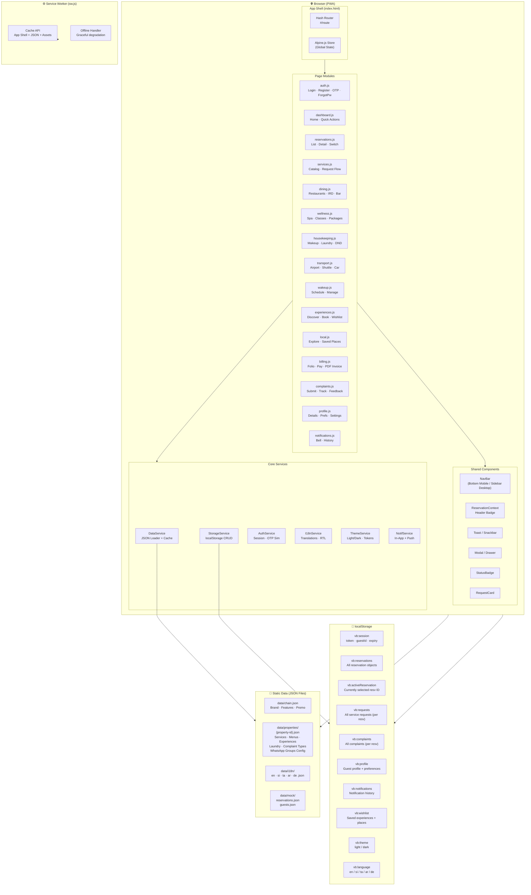

---

## 4. Project Structure

```
Destinity vButler/
│
├── index.html                    ← App Shell (single entry point)
├── manifest.json                 ← PWA manifest
├── sw.js                         ← Service Worker
├── favicon.ico
│
├── assets/
│   ├── css/
│   │   ├── tailwind.config.js    ← Tailwind custom tokens (via CDN config)
│   │   └── app.css               ← Custom CSS (RTL overrides, animations, scrollbar)
│   ├── images/
│   │   ├── chain/
│   │   │   ├── logo.svg
│   │   │   ├── logo-dark.svg
│   │   │   └── favicon.png
│   │   └── properties/
│   │       ├── newburge-ella/    ← Hero, gallery, dining, experience images
│   │       └── colombo-city/
│   ├── icons/                    ← PWA icons (192x192, 512x512)
│   └── lottie/                   ← Lottie JSON animation files
│       ├── success.json
│       ├── loading.json
│       └── empty-state.json
│
├── data/                         ← ALL STATIC DATA (no backend)
│   ├── chain.json                ← Chain-level brand, features, promotions
│   ├── properties/
│   │   ├── newburge-ella.json    ← All property-specific data
│   │   ├── colombo-city.json
│   │   └── kandy-hills.json
│   ├── mock/
│   │   ├── reservations.json     ← Demo reservation data for prototyping
│   │   └── guests.json           ← Demo guest accounts
│   └── i18n/
│       ├── en.json
│       ├── si.json
│       ├── ta.json
│       ├── ar.json               ← Arabic (RTL)
│       └── de.json
│
├── js/
│   ├── app.js                    ← Bootstrap: init router, stores, services
│   ├── router.js                 ← Hash-based SPA router
│   │
│   ├── core/                     ← Shared services (no UI)
│   │   ├── data.service.js       ← JSON fetch + in-memory cache
│   │   ├── storage.service.js    ← localStorage abstraction
│   │   ├── auth.service.js       ← Session, OTP simulation, login/logout
│   │   ├── reservation.service.js← Reservation state management
│   │   ├── request.service.js    ← Service requests CRUD
│   │   ├── complaint.service.js  ← Complaints CRUD + status flow
│   │   ├── notification.service.js← In-app notification engine
│   │   ├── i18n.service.js       ← Translation lookup + language switching
│   │   └── theme.service.js      ← Dark/Light mode toggle + CSS variables
│   │
│   ├── components/               ← Reusable UI building blocks
│   │   ├── nav-bar.js            ← Bottom nav (mobile) / Sidebar (desktop)
│   │   ├── reservation-header.js ← Context strip (property + dates)
│   │   ├── toast.js              ← Toast/snackbar notifications
│   │   ├── modal.js              ← Modal + bottom drawer
│   │   ├── status-badge.js       ← Coloured status pills
│   │   ├── request-card.js       ← Service request status card
│   │   ├── star-rating.js        ← 5-star rating input
│   │   ├── file-upload.js        ← Document/photo upload (base64 → localStorage)
│   │   └── otp-input.js          ← 6-digit OTP input group
│   │
│   └── pages/                    ← One file per screen/feature module
│       ├── auth/
│       │   ├── login.js
│       │   ├── register.js
│       │   ├── otp-verify.js
│       │   └── forgot-password.js
│       ├── dashboard.js
│       ├── reservations/
│       │   ├── list.js
│       │   └── detail.js
│       ├── pre-arrival.js
│       ├── services/
│       │   ├── catalog.js
│       │   └── request-form.js
│       ├── dining/
│       │   ├── index.js
│       │   ├── restaurant-detail.js
│       │   └── in-room-dining.js
│       ├── wellness.js
│       ├── housekeeping/
│       │   ├── index.js
│       │   └── laundry.js
│       ├── transport.js
│       ├── wake-up.js
│       ├── experiences/
│       │   ├── index.js
│       │   └── booking.js
│       ├── local-explore.js
│       ├── billing/
│       │   ├── index.js
│       │   └── payment.js
│       ├── complaints/
│       │   ├── index.js
│       │   ├── submit.js
│       │   └── detail.js
│       ├── profile/
│       │   ├── index.js
│       │   └── settings.js
│       └── notifications.js
│
└── pages/                        ← HTML page fragments (loaded by router)
    ├── auth/
    ├── dashboard.html
    ├── reservations.html
    └── ...
```

---

## 5. Data Architecture

### 5.1 JSON Config Files (Static Data Source)

The app operates on **two tiers of JSON data**, mirroring the PRD's two-tier content management model. There is no CMS in Phase 1 — files are edited directly.

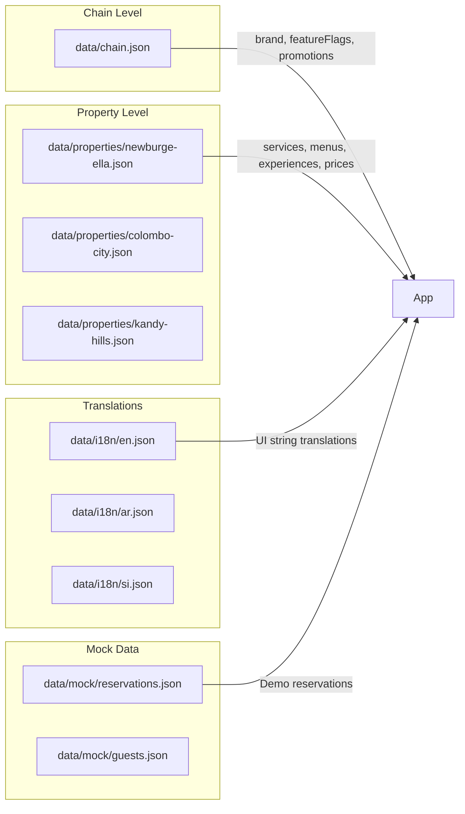

---

### 5.2 JSON Schema Definitions

#### `data/chain.json`

```json
{
  "chain": {
    "id": "browns-hotels-resorts",
    "name": "Browns Hotels & Resorts",
    "logo": "/assets/images/chain/logo.svg",
    "logoDark": "/assets/images/chain/logo-dark.svg",
    "primaryColor": "#003c52",
    "website": "https://www.brownshotels.com",
    "supportEmail": "guest@brownshotels.com"
  },
  "featureFlags": {
    "preArrivalChecklist": true,
    "inAppPayments": true,
    "wakeUpCall": true,
    "localExploration": true,
    "wellnessSpa": true,
    "loyaltyPoints": false,
    "inAppChat": false
  },
  "promotions": [
    {
      "id": "promo-001",
      "title": "Ella Weekend Escape",
      "description": "20% off Wellness packages this April.",
      "imageUrl": "/assets/images/chain/promo-ella.jpg",
      "targetProperties": ["newburge-ella"],
      "validFrom": "2026-04-01",
      "validTo": "2026-04-30",
      "ctaLabel": "Book Now",
      "ctaUrl": "https://www.brownshotels.com/offers/ella-escape"
    }
  ],
  "properties": [
    { "id": "newburge-ella", "name": "Browns Hotel Newburge Ella", "dataFile": "newburge-ella.json" },
    { "id": "colombo-city",  "name": "Browns City Hotel Colombo",  "dataFile": "colombo-city.json" }
  ]
}
```

---

#### `data/properties/{property-id}.json`

```json
{
  "property": {
    "id": "newburge-ella",
    "name": "Browns Hotel Newburge Ella",
    "tagline": "Escape to the hills of Ella",
    "address": "Kings Road, Ella, Badulla District, Sri Lanka",
    "phone": "+94 57 222 8888",
    "email": "ella@brownshotels.com",
    "currency": "LKR",
    "timezone": "Asia/Colombo",
    "heroImages": [
      "/assets/images/properties/newburge-ella/hero-1.jpg",
      "/assets/images/properties/newburge-ella/hero-2.jpg"
    ],
    "facilities": ["Pool", "Spa", "Restaurant", "Bar", "Gym", "Free WiFi"]
  },

  "quickActions": [
    { "id": "services",     "label": "Services",      "icon": "room_service",    "route": "#/services" },
    { "id": "dining",       "label": "Dining",         "icon": "restaurant",      "route": "#/dining" },
    { "id": "wellness",     "label": "Wellness",       "icon": "spa",             "route": "#/wellness" },
    { "id": "my-bill",      "label": "My Bill",        "icon": "receipt_long",    "route": "#/billing" },
    { "id": "experiences",  "label": "Experiences",    "icon": "hiking",          "route": "#/experiences" },
    { "id": "complaints",   "label": "Complaints",     "icon": "support_agent",   "route": "#/complaints" },
    { "id": "room-request", "label": "Room Requests",  "icon": "bed",             "route": "#/housekeeping" },
    { "id": "explore",      "label": "Explore",        "icon": "explore",         "route": "#/local" }
  ],

  "services": {
    "categories": [
      {
        "id": "dining",
        "label": "Dining & Bars",
        "icon": "restaurant",
        "items": [
          {
            "id": "inroom-dining",
            "name": "In-Room Dining",
            "description": "Order from our full menu, delivered to your room.",
            "price": null,
            "priceNote": "Charges added to folio",
            "availableHours": { "from": "07:00", "to": "22:00" },
            "estimatedTime": "30–45 minutes",
            "requiresBooking": false,
            "fields": ["deliveryTime", "specialInstructions"]
          }
        ]
      },
      {
        "id": "housekeeping",
        "label": "Housekeeping",
        "icon": "cleaning_services",
        "items": [
          {
            "id": "room-makeup",
            "name": "Room Makeup",
            "description": "Full room cleaning at your preferred time.",
            "price": null,
            "priceNote": "Complimentary",
            "availableHours": { "from": "08:00", "to": "17:00" },
            "estimatedTime": "45 minutes",
            "requiresBooking": true,
            "fields": ["preferredTime"]
          },
          {
            "id": "extra-towels",
            "name": "Extra Towels",
            "description": "Request additional bath or pool towels.",
            "price": null,
            "priceNote": "Complimentary",
            "availableHours": { "from": "00:00", "to": "23:59" },
            "estimatedTime": "15 minutes",
            "requiresBooking": false,
            "fields": ["quantity", "towelType"]
          }
        ]
      }
    ]
  },

  "laundryPriceList": [
    { "id": "shirt",         "name": "Shirt / Blouse",      "wash": 350,  "ironOnly": 200, "expressMultiplier": 1.5 },
    { "id": "trouser",       "name": "Trousers / Pants",    "wash": 400,  "ironOnly": 250, "expressMultiplier": 1.5 },
    { "id": "dress",         "name": "Dress / Skirt",       "wash": 500,  "ironOnly": 300, "expressMultiplier": 1.5 },
    { "id": "suit",          "name": "Suit (2 piece)",      "wash": 1200, "ironOnly": 600, "expressMultiplier": 1.5 },
    { "id": "underwear",     "name": "Underwear",           "wash": 200,  "ironOnly": null,"expressMultiplier": 1.5 },
    { "id": "socks",         "name": "Socks (pair)",        "wash": 150,  "ironOnly": null,"expressMultiplier": 1.5 },
    { "id": "bed-sheet",     "name": "Bed Sheet",           "wash": 600,  "ironOnly": 300, "expressMultiplier": 1.5 },
    { "id": "bath-robe",     "name": "Bath Robe",           "wash": 700,  "ironOnly": null,"expressMultiplier": 1.5 }
  ],

  "dining": {
    "restaurants": [
      {
        "id": "the-summit",
        "name": "The Summit Restaurant",
        "cuisine": "Sri Lankan & International",
        "description": "Panoramic views of the Ella Gap with a menu celebrating local ingredients.",
        "hours": { "breakfast": "07:00–10:30", "lunch": "12:00–14:30", "dinner": "18:30–22:00" },
        "images": ["/assets/images/properties/newburge-ella/summit-1.jpg"],
        "acceptsReservations": true,
        "cancellationCutoffHours": 1,
        "menu": [
          {
            "category": "Starters",
            "items": [
              { "id": "ts-001", "name": "Prawn Cocktail", "description": "Tiger prawns, marie rose sauce.", "price": 1800, "tags": ["seafood"], "image": null },
              { "id": "ts-002", "name": "Soup of the Day", "description": "Ask your server for today's selection.", "price": 900, "tags": ["vegetarian-option"], "image": null }
            ]
          },
          {
            "category": "Mains",
            "items": [
              { "id": "ts-003", "name": "Grilled Barramundi", "description": "Lemon butter, seasonal vegetables.", "price": 4500, "tags": ["seafood", "gluten-free"], "image": null }
            ]
          }
        ]
      }
    ]
  },

  "wellness": {
    "treatments": [
      {
        "id": "deep-tissue",
        "name": "Deep Tissue Massage",
        "description": "Targets deep muscle layers to release chronic tension.",
        "duration": 60,
        "price": 8500,
        "therapistPreference": true,
        "cancellationPolicy": "Cancel at least 4 hours in advance."
      },
      {
        "id": "couples-retreat",
        "name": "Couples Retreat Package",
        "description": "Side-by-side massages, floral bath, and herbal tea ritual.",
        "duration": 120,
        "price": 22000,
        "therapistPreference": false,
        "cancellationPolicy": "Cancel at least 6 hours in advance."
      }
    ],
    "classes": [
      {
        "id": "sunrise-yoga",
        "name": "Sunrise Yoga",
        "description": "Open-air yoga session overlooking the Ella hills.",
        "schedule": ["Mon 06:30", "Wed 06:30", "Fri 06:30", "Sun 06:30"],
        "duration": 60,
        "price": 2500,
        "maxParticipants": 10
      }
    ]
  },

  "transport": {
    "options": [
      {
        "id": "airport-arrival",
        "type": "airport",
        "direction": "arrival",
        "name": "Airport Arrival Transfer",
        "vehicles": [
          { "type": "sedan",   "label": "Sedan (3 pax)",  "price": 15000 },
          { "type": "van",     "label": "Van (8 pax)",    "price": 22000 },
          { "type": "suv",     "label": "SUV (5 pax)",    "price": 18000 }
        ],
        "requiredFields": ["flightNumber", "arrivalDate", "arrivalTime", "passengerCount"]
      },
      {
        "id": "local-tuktuk",
        "type": "local",
        "name": "Tuk-Tuk (Local)",
        "vehicles": [
          { "type": "tuktuk", "label": "Tuk-Tuk (3 pax)", "price": 500, "priceNote": "per trip" }
        ],
        "requiredFields": ["destination", "date", "time", "passengerCount"]
      }
    ]
  },

  "experiences": [
    {
      "id": "little-adams-peak",
      "name": "Little Adam's Peak Trek",
      "category": "Adventure",
      "description": "Guided sunrise trek to the iconic Little Adam's Peak. Witness breathtaking views of Ella Gap and Nine Arches Bridge.",
      "duration": "3 hours",
      "inclusions": ["Certified guide", "Walking sticks", "Refreshments on return"],
      "price": 5500,
      "priceNote": "per person",
      "minGuests": 1,
      "maxGuests": 8,
      "bookingCutoffHours": 12,
      "availableDays": ["Mon", "Tue", "Wed", "Thu", "Fri", "Sat", "Sun"],
      "startTime": "05:30",
      "images": ["/assets/images/properties/newburge-ella/exp-trek-1.jpg"],
      "isFeatured": true,
      "addOns": [
        { "id": "packed-breakfast", "name": "Packed Breakfast", "price": 1200 }
      ]
    },
    {
      "id": "cooking-class",
      "name": "Sri Lankan Cooking Class",
      "category": "Culinary",
      "description": "Learn to prepare authentic Sri Lankan curries and hoppers with our head chef.",
      "duration": "2.5 hours",
      "inclusions": ["All ingredients", "Recipe cards", "Lunch of what you cook"],
      "price": 8000,
      "priceNote": "per person",
      "minGuests": 2,
      "maxGuests": 6,
      "bookingCutoffHours": 24,
      "availableDays": ["Tue", "Thu", "Sat"],
      "startTime": "10:00",
      "images": ["/assets/images/properties/newburge-ella/exp-cooking-1.jpg"],
      "isFeatured": false,
      "addOns": []
    }
  ],

  "localPlaces": [
    {
      "id": "nine-arches",
      "name": "Nine Arches Bridge",
      "category": "Culture",
      "description": "Iconic colonial-era viaduct surrounded by tea plantations.",
      "distanceKm": 2.1,
      "travelTime": "10 min by tuk-tuk",
      "hotelNote": "Best viewed at 08:30 or 15:15 when the train passes. Ask our concierge for exact timings.",
      "mapUrl": "https://maps.google.com/?q=Nine+Arches+Bridge+Ella",
      "images": ["/assets/images/properties/newburge-ella/place-nine-arches.jpg"]
    },
    {
      "id": "ella-rock",
      "name": "Ella Rock",
      "category": "Adventure",
      "description": "Challenging but rewarding hike with panoramic valley views.",
      "distanceKm": 4.5,
      "travelTime": "20 min by tuk-tuk + 3hr hike",
      "hotelNote": "Our concierge can arrange a guide. Start early to avoid heat.",
      "mapUrl": "https://maps.google.com/?q=Ella+Rock+Sri+Lanka",
      "images": []
    }
  ],

  "complaintCategories": [
    {
      "id": "room",
      "label": "Room",
      "icon": "bed",
      "subcategories": ["Cleanliness", "Maintenance / Repair", "Room Temperature", "Noise", "Amenities Missing", "Other"]
    },
    {
      "id": "dining",
      "label": "Dining",
      "icon": "restaurant",
      "subcategories": ["Food Quality", "Service Speed", "Order Incorrect", "Billing Error", "Hygiene", "Other"]
    },
    {
      "id": "service",
      "label": "Service",
      "icon": "room_service",
      "subcategories": ["Request Not Fulfilled", "Delayed Response", "Staff Attitude", "Other"]
    },
    {
      "id": "facilities",
      "label": "Facilities",
      "icon": "pool",
      "subcategories": ["Pool", "Gym", "Spa", "WiFi / Internet", "Parking", "Other"]
    },
    {
      "id": "staff",
      "label": "Staff",
      "icon": "person",
      "subcategories": ["Rude / Unprofessional", "Incorrect Information", "Unhelpful", "Other"]
    },
    {
      "id": "other",
      "label": "Other",
      "icon": "help_outline",
      "subcategories": ["General Feedback", "Safety Concern", "Other"]
    }
  ],

  "whatsappGroups": {
    "housekeeping": "+94701234001",
    "fnb": "+94701234002",
    "concierge": "+94701234003",
    "frontDesk": "+94701234004",
    "dutyManager": "+94701234005",
    "gm": "+94701234006"
  }
}
```

---

#### `data/mock/reservations.json`

```json
{
  "reservations": [
    {
      "id": "RES-20260401-001",
      "guestEmail": "demo@guest.com",
      "propertyId": "newburge-ella",
      "propertyName": "Browns Hotel Newburge Ella",
      "roomNumber": "205",
      "roomType": "Deluxe King with Valley View",
      "checkIn": "2026-04-05",
      "checkOut": "2026-04-08",
      "adults": 2,
      "children": 0,
      "status": "upcoming",
      "bookingSource": "Browns Website",
      "specialRequests": "Late check-out if possible. Celebrating anniversary.",
      "balance": 145000,
      "currency": "LKR",
      "folio": [
        { "date": "2026-04-05", "description": "Room (Deluxe King) × 3 nights", "amount": 135000, "category": "Room" },
        { "date": "2026-04-05", "description": "Advance Deposit Paid",           "amount": -50000, "category": "Payment" }
      ]
    },
    {
      "id": "RES-20260301-004",
      "guestEmail": "demo@guest.com",
      "propertyId": "colombo-city",
      "propertyName": "Browns City Hotel Colombo",
      "roomNumber": "812",
      "roomType": "Superior Twin",
      "checkIn": "2026-03-10",
      "checkOut": "2026-03-12",
      "adults": 1,
      "children": 0,
      "status": "checked-out",
      "bookingSource": "Booking.com",
      "specialRequests": "",
      "balance": 0,
      "currency": "LKR",
      "folio": [
        { "date": "2026-03-10", "description": "Room (Superior Twin) × 2 nights", "amount": 64000,  "category": "Room" },
        { "date": "2026-03-11", "description": "The Summit — Dinner (2 pax)",      "amount": 8500,   "category": "Dining" },
        { "date": "2026-03-12", "description": "Full Payment",                     "amount": -72500, "category": "Payment" }
      ]
    }
  ]
}
```

---

### 5.3 localStorage Schema (Runtime Persistence)

All localStorage keys are namespaced under `vb:` to avoid collisions.

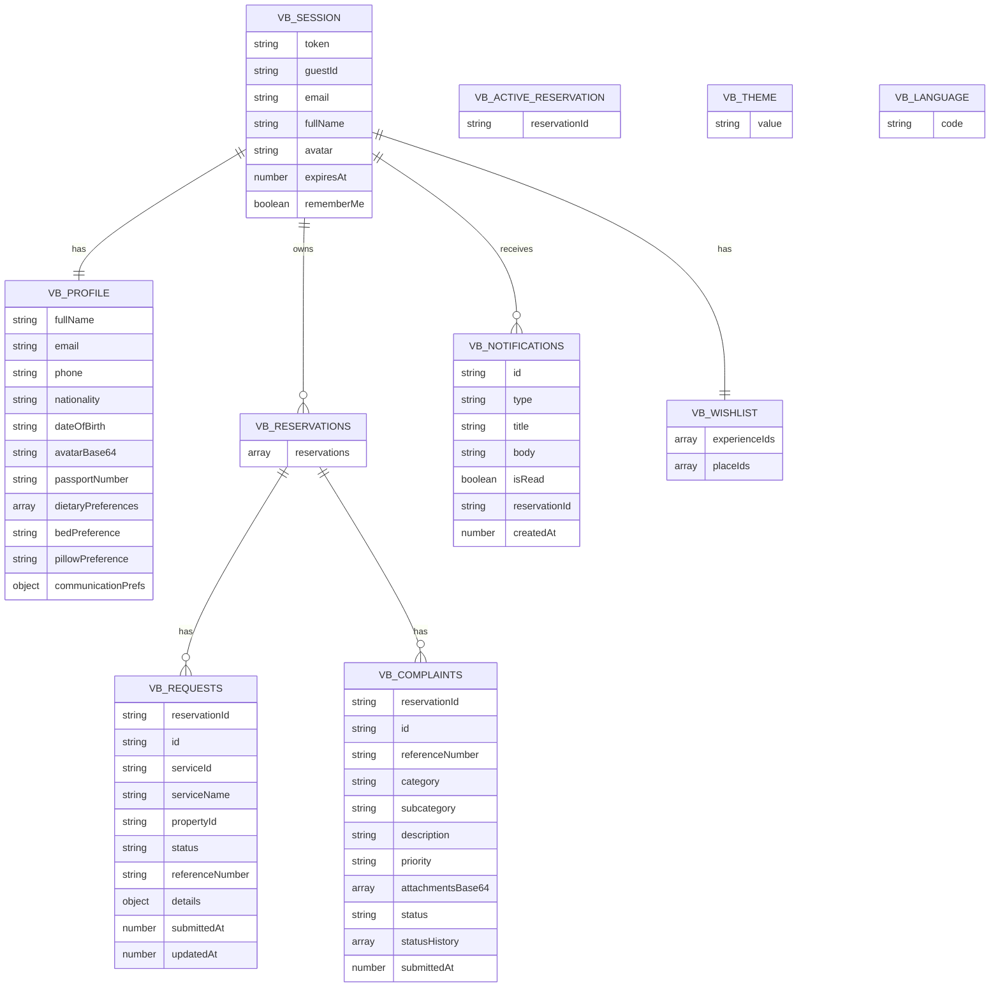

#### localStorage Key Reference

| Key | Type | Description |
|-----|------|-------------|
| `vb:session` | Object | Auth token, guest ID, expiry |
| `vb:profile` | Object | Guest profile & preferences |
| `vb:reservations` | Array | All reservation objects |
| `vb:activeReservation` | String | Currently selected reservation ID |
| `vb:requests` | Array | All service requests across reservations |
| `vb:complaints` | Array | All complaints across reservations |
| `vb:notifications` | Array | In-app notification history |
| `vb:wishlist` | Object | Saved experience IDs + place IDs |
| `vb:theme` | String | `"light"` or `"dark"` |
| `vb:language` | String | `"en"`, `"si"`, `"ta"`, `"ar"`, `"de"` |
| `vb:preArrival:{resvId}` | Object | Pre-arrival checklist progress |
| `vb:wakeupCalls:{resvId}` | Array | Scheduled wake-up calls |

---

## 6. Module Architecture

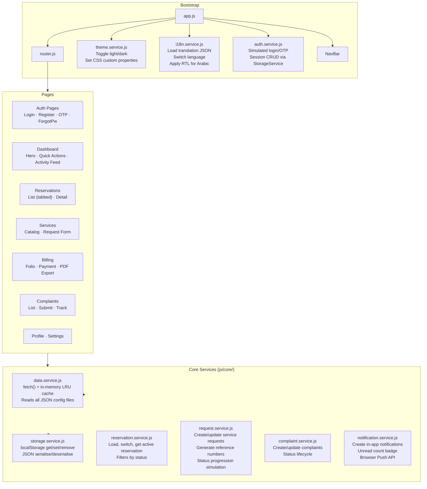

---

## 6b. Responsive Layout Architecture

### Breakpoints

| Breakpoint | Target Devices | Layout |
|------------|---------------|--------|
| `< 1024px` | Mobile + Tablet | Mobile shell: `max-width: 480px`, centred with `margin: 0 auto`, bottom tab bar navigation, glass header |
| `≥ 1024px` | Laptop + Desktop | Full-width layout: left sidebar `260px` + content area `flex: 1`, no mobile header, no bottom nav |

### App Shell Structure (`index.html`)

```
#app  (flex-row on desktop, flex-col on mobile)
├── #desktop-sidebar     ← hidden < 1024px; fixed 260px on ≥ 1024px
│   ├── Logo + Property name
│   ├── Guest card (avatar, name, room, notification bell)
│   ├── <nav> (16 links in 4 groups)
│   │   ├── Main: Dashboard, My Stays, Pre-Arrival
│   │   ├── Dining & Leisure: Dining, Wellness, Experiences, Local Explore
│   │   ├── Room Services: Services, Housekeeping, Transport, Wake-Up Call
│   │   └── Account: Billing, Complaints, Notifications, Profile, Settings
│   └── Footer: Language picker, Sign Out
├── #app-header          ← shown < 1024px only (glass header + reservation strip)
├── #page-content        ← router injection target; flex:1 on desktop
└── #bottom-nav          ← shown < 1024px only (5-tab bar)
```

### CSS Strategy

- `#desktop-sidebar { display: none }` by default (mobile-first)
- `@media (min-width: 1024px)` block in `app.css` switches layout:
  - `#app { flex-direction: row; max-width: none }`
  - `#desktop-sidebar { display: flex; width: 260px; position: sticky; height: 100vh }`
  - `#app-header { display: none !important }`
  - `.bottom-nav { display: none !important }`
  - `#page-content { padding-bottom: 0 }`
- Sidebar background: brand primary `#003c52` (dark mode: `#002a3b`)
- Active nav items use `data-route` attribute — the router's existing `querySelectorAll('.nav-item[data-route]')` loop also covers `.sidebar-nav-item[data-route]` elements automatically

### Alpine.js Integration

The sidebar uses a dedicated `desktopSidebar()` component registered inline in `index.html`:
- Reads `$store.auth`, `$store.reservation`, `$store.notifications`, `$store.ui` stores
- Controls the language picker popup (`showLangPicker`)
- Calls `AuthService.logout()` for Sign Out
- Shows/hides via `x-show="$store.auth.isAuthenticated"` (hidden on login/register pages)

---

## 7. Routing Architecture

Destinity vButler uses a **client-side hash router** (`window.location.hash`). No server-side routing is required — the app is served from a single `index.html`.

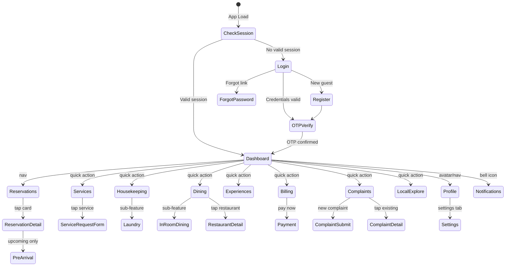

### Route Table

| Route | Page | Auth Required |
|-------|------|--------------|
| `#/login` | Login | No |
| `#/register` | Register | No |
| `#/otp` | OTP Verify | No |
| `#/forgot-password` | Forgot Password | No |
| `#/dashboard` | Home Dashboard | Yes |
| `#/reservations` | Reservation List | Yes |
| `#/reservations/:id` | Reservation Detail | Yes |
| `#/pre-arrival/:id` | Pre-Arrival Checklist | Yes |
| `#/services` | Services Catalog | Yes |
| `#/services/request/:serviceId` | Service Request Form | Yes |
| `#/dining` | Dining Index | Yes |
| `#/dining/:restaurantId` | Restaurant Detail | Yes |
| `#/dining/in-room` | In-Room Dining Cart | Yes |
| `#/wellness` | Wellness Catalog | Yes |
| `#/housekeeping` | Housekeeping Index | Yes |
| `#/housekeeping/laundry` | Laundry Service | Yes |
| `#/transport` | Transport & Transfers | Yes |
| `#/wake-up` | Wake-Up Call | Yes |
| `#/experiences` | Curated Experiences | Yes |
| `#/experiences/:id` | Experience Detail + Booking | Yes |
| `#/local` | Local Exploration | Yes |
| `#/billing` | Billing & Folio | Yes |
| `#/billing/pay` | Payment Flow | Yes |
| `#/complaints` | Complaints List | Yes |
| `#/complaints/new` | Submit Complaint | Yes |
| `#/complaints/:id` | Complaint Detail | Yes |
| `#/profile` | Guest Profile | Yes |
| `#/settings` | Settings | Yes |
| `#/notifications` | Notification History | Yes |

---

## 8. State Management

Alpine.js is used for reactive UI state. A **global Alpine store** (`Alpine.store`) is the single source of truth for cross-page shared state.

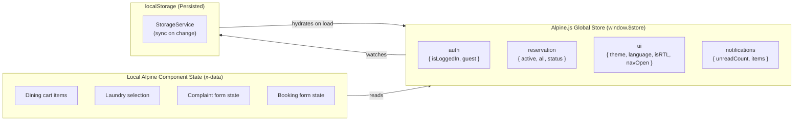

### Store Initialisation Flow

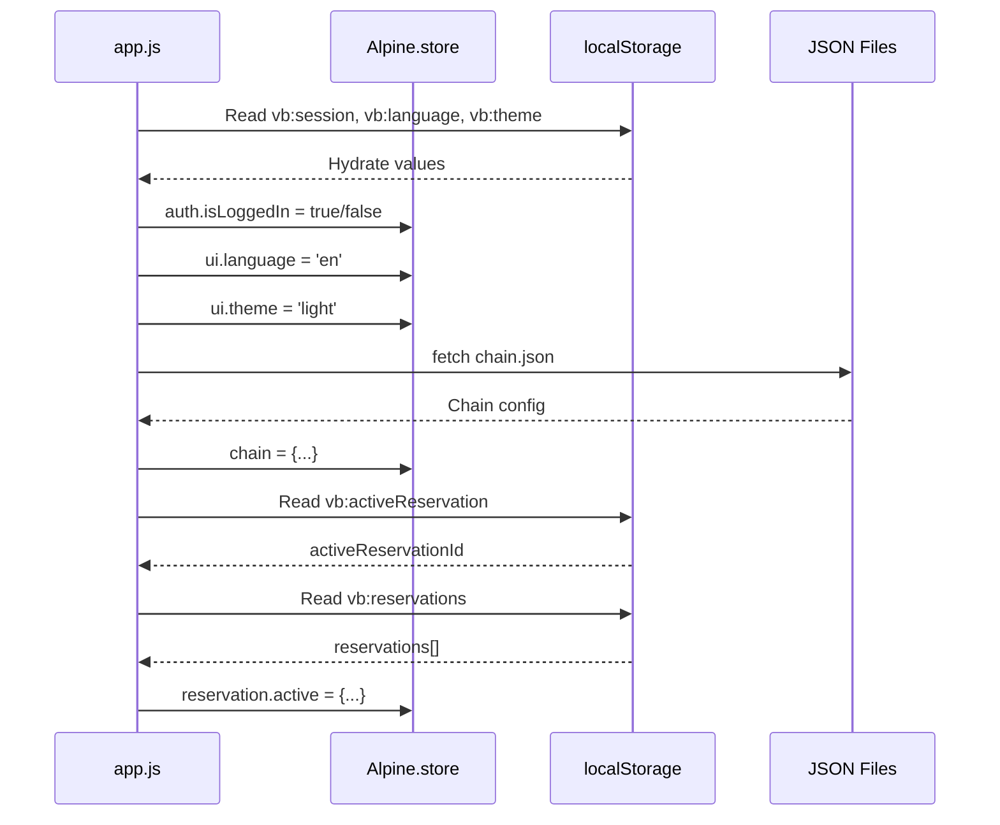

---

## 9. Component Library

All shared UI components are implemented as Alpine.js components or Web Components.

| Component | File | Description |
|-----------|------|-------------|
| `<nav-bar>` | `components/nav-bar.js` | Bottom tab bar (mobile/tablet, `< 1024px`) / Left sidebar (desktop, `≥ 1024px`). Active route highlighting via `data-route` attribute matched by the router. |
| `<reservation-header>` | `components/reservation-header.js` | Sticky top strip: property name, dates, status badge. Visible on all authenticated pages. |
| `<toast>` | `components/toast.js` | Slide-in success/error/info toasts. Auto-dismiss. |
| `<modal>` | `components/modal.js` | Centred modal (desktop) + bottom sheet drawer (mobile). |
| `<status-badge>` | `components/status-badge.js` | Coloured pill: Active (green), Upcoming (blue), Checked-Out (grey), Cancelled (red). |
| `<request-card>` | `components/request-card.js` | Service request summary card with status timeline. |
| `<star-rating>` | `components/star-rating.js` | Interactive 5-star input for post-stay feedback. |
| `<file-upload>` | `components/file-upload.js` | Image/document upload. Converts to Base64. Stores in localStorage. |
| `<otp-input>` | `components/otp-input.js` | Six individual digit boxes. Auto-advance focus. Paste support. |
| `<loading-state>` | `components/loading-state.js` | Lottie spinner overlay. |
| `<empty-state>` | `components/empty-state.js` | Lottie + message for empty lists. |
| `<reservation-switcher>` | `components/reservation-switcher.js` | Dropdown/drawer to switch active reservation context. |

---

## 10. Data Flow Diagrams

### 10.1 Service Request Flow

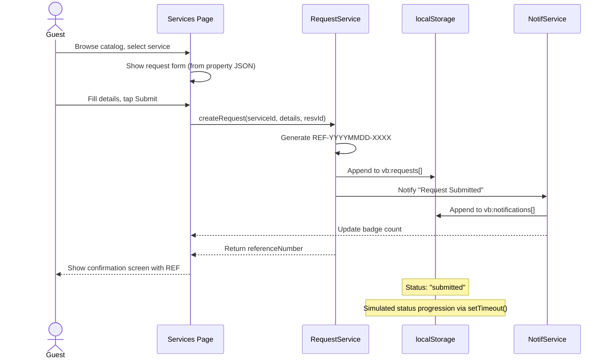

### 10.2 Authentication Flow

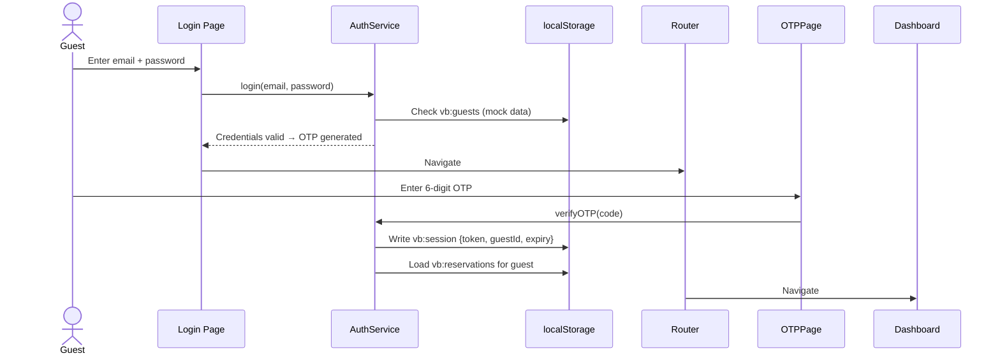

### 10.3 Property Data Loading

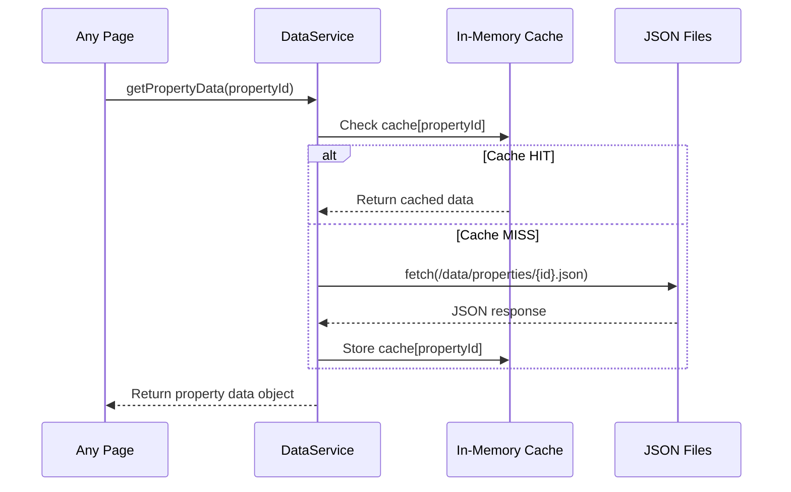

### 10.4 Billing & PDF Invoice Flow

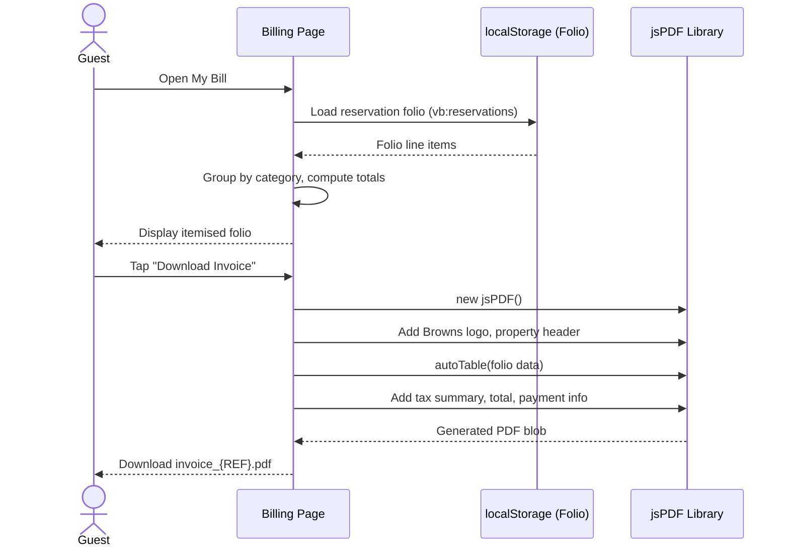

---

## 11. Feature-to-Module Map

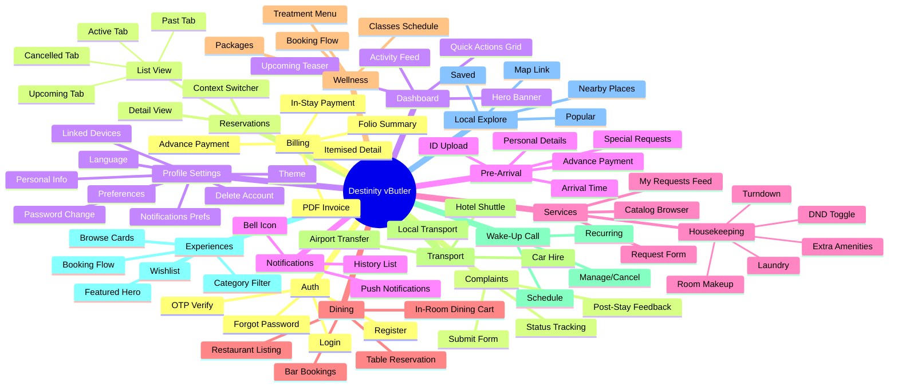

---

## 12. i18n Architecture

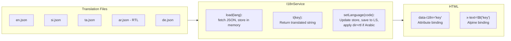

### RTL Support (Arabic)

When language is set to `ar`, the service:
1. Sets `<html dir="rtl">` attribute
2. Adds `rtl` class to `<body>` for Tailwind RTL utilities
3. Tailwind's `rtl:` prefix handles layout mirroring (margins, padding, flex direction, text alignment)
4. Navigation order, icon placement, and scroll direction automatically mirror

### Translation Key Structure (`en.json`)

```json
{
  "nav": {
    "home": "Home",
    "reservations": "Reservations",
    "services": "Services",
    "billing": "My Bill",
    "profile": "Profile"
  },
  "auth": {
    "login": { "title": "Welcome Back", "emailLabel": "Email Address", "passwordLabel": "Password", "submitBtn": "Continue", "forgotPassword": "Forgot password?" },
    "otp": { "title": "Verify Your Email", "subtitle": "We sent a 6-digit code to {{email}}", "resendBtn": "Resend Code", "expiresIn": "Expires in {{minutes}}m {{seconds}}s" }
  },
  "dashboard": {
    "welcome": "Welcome back, {{name}}",
    "dayOf": "Day {{current}} of {{total}}",
    "checkInIn": "Check-in in {{days}} days"
  },
  "status": {
    "upcoming": "Upcoming",
    "active": "Active",
    "checkedOut": "Checked Out",
    "cancelled": "Cancelled",
    "submitted": "Submitted",
    "acknowledged": "Acknowledged",
    "inProgress": "In Progress",
    "resolved": "Resolved",
    "closed": "Closed"
  }
}
```

---

## 13. PWA Configuration

### `manifest.json`

```json
{
  "name": "Destinity vButler — Browns Hotels",
  "short_name": "Destinity vButler",
  "description": "Your personal butler at Browns Hotels & Resorts",
  "start_url": "/index.html#/dashboard",
  "display": "standalone",
  "orientation": "portrait-primary",
  "background_color": "#003c52",
  "theme_color": "#003c52",
  "icons": [
    { "src": "/assets/icons/icon-192.png", "sizes": "192x192", "type": "image/png", "purpose": "maskable any" },
    { "src": "/assets/icons/icon-512.png", "sizes": "512x512", "type": "image/png", "purpose": "maskable any" }
  ]
}
```

### Service Worker Strategy (`sw.js`)

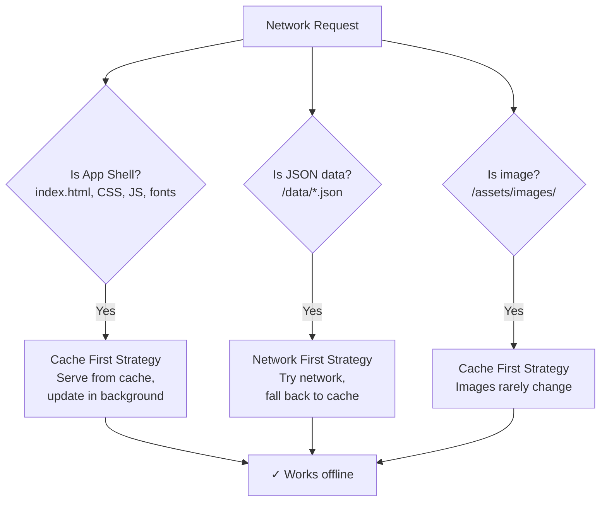

### Cached Assets

- App shell: `index.html`, `app.css`, all JS modules
- Static data: all `/data/*.json` files
- Fonts: Inter, Playfair Display (Google Fonts)
- Icons: Material Symbols stylesheet
- Property images: cached on first load per property
- Lottie animations: all `/assets/lottie/*.json`

---

## 14. Theming System

### Tailwind Custom Config (injected via CDN config block)

```javascript
tailwind.config = {
  darkMode: 'class',
  theme: {
    extend: {
      colors: {
        brand: {
          DEFAULT: '#003c52',
          light:   '#00516e',
          dark:    '#002838',
        },
        surface: {
          light: '#f5f8f8',
          dark:  '#0f1e23',
        }
      },
      fontFamily: {
        sans:    ['Inter', 'sans-serif'],
        display: ['Playfair Display', 'serif'],
      },
      borderRadius: {
        DEFAULT: '4px',
        lg:      '8px',
        xl:      '12px',
        full:    '9999px',
      }
    }
  }
}
```

### Theme Toggle Mechanism

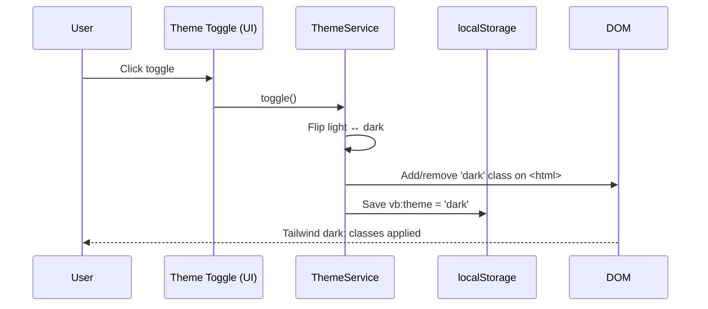

---

## 15. Security Considerations

> Note: As this is a client-only app with localStorage, the following reflects best practices within that constraint. A backend is required for production-grade security.

| Concern | Approach |
|---------|---------|
| **Session tokens** | Simulated JWT-like token stored in localStorage. Must be replaced with real JWT from backend in production. |
| **OTP simulation** | OTP is console-logged in dev mode only. In production, this is replaced with real email delivery via backend. |
| **Sensitive data in localStorage** | No real payment card data is ever stored. Folio data is mock. ID/passport images stored as Base64 are cleared on session expiry. |
| **XSS prevention** | All dynamic content rendered via `textContent` / Alpine.js bindings (not `innerHTML`). Marked.js used only for hotel-provided markdown with sanitiser enabled. |
| **HTTPS only** | PWA manifest and service worker require HTTPS in production (localhost exempted). |
| **Content Security Policy** | CSP meta tag in `index.html` restricts script sources to self + CDN allowlist. |
| **Input validation** | All form inputs validated client-side before submission (email regex, phone format, date constraints). |
| **Session expiry** | `vb:session.expiresAt` checked on every page load. Expired sessions redirect to login. |
| **Account deletion** | Clears all `vb:*` localStorage keys for that guest. |

---

*Document Owner: Solutions Architecture — Destinity vButler*
*Based on:* [Product Requirements Document](./prd.md)
*Last Updated: 2026-03-15*
